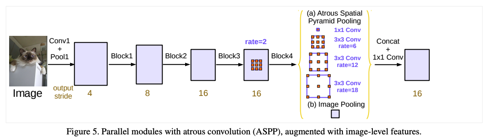
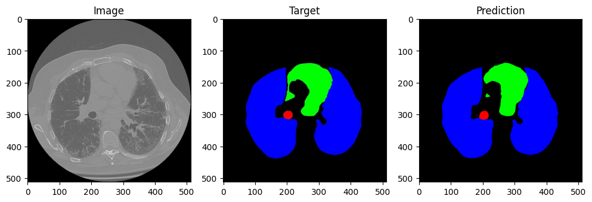
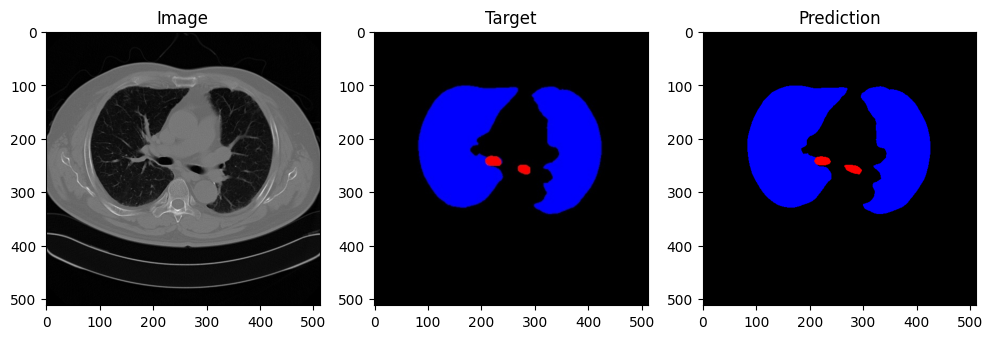
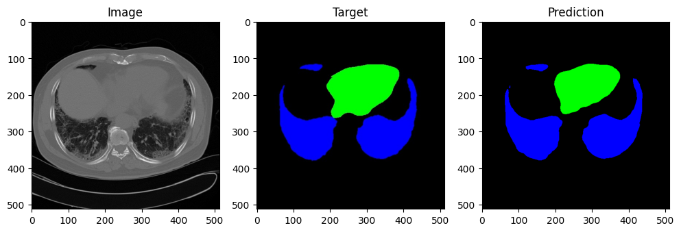
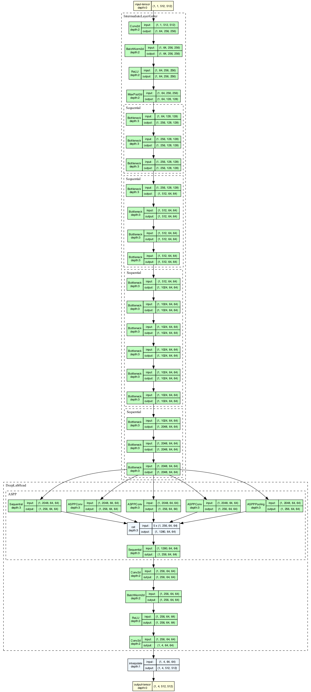

# DeepLabv3 for Chest CT Segmentation


**Source**: [*Rethinking Atrous Convolution for Semantic Image Segmentation*](https://arxiv.org/abs/1706.05587)

## Dataset

| Data Split     | Size   | Composition  |
|----------------|--------|--------------|
| Training Set   | 11,695 |     ~70%     |
| Validation Set | 2,506  |     ~15%     |
| Test Set       | 2,507  |     ~15%     |

Original data source: *https://www.kaggle.com/datasets/polomarco/chest-ct-segmentation*

My train-val-test split can be accessed [*here*](https://drive.google.com/file/d/1unTX4C_f9FjHYIneIOJ3cTh9UMh7FuKY/view?usp=sharing).

## Installation
```bash
pip install -r requirements.txt
```

## Navigate to Source Directory
```bash
cd src
```

## Training Configuration
Configure the model for training through `train_config.yaml` under the `src/config` directory.

An example config is shown below:

```yaml
num_classes: 4
epochs: 50
batch_size: 100

backbone: "resnet50"
learning_rate: 0.0001
weight_decay: 0.0001
seed: 42
```

### Note:
- The model contains constructors for 2 DeepLabv3 backbones, namely `ResNet50` and `ResNet101`.
- This can be configured through the `backbone` parameter within `train_config.yaml`.
    - Input should be one of: `resnet50` or `resnet101`.

## Inference Configuration
Configure the model for inference through `inference_config.yaml` under the `src/config` directory.

Example shorn below:

```yaml
num_classes: 4
batch_size: 100
backbone: "resnet50"
id: "06-16-2024-12:00"
weights: "resnet50_backbone_highest_miou.pth"
```

### Note: 
- `id` is a unique identifier for each training run, which also happens to be its timestamp.
- Three model weights are saved per training run: 
    - The latest model.
    - The model with the lowest loss.
    - The model with the highest mIOU.

## Training and Inference
From the `src` directory, run:

```bash
# training
python train.py
```

```bash
# inference
python inference.py
```

## Tensorboard
From the `src` directory, run:

```bash
tensorboard --logdir runs
```

## Results
### mIOU: 92.8%





## Model Architecture in Detail
